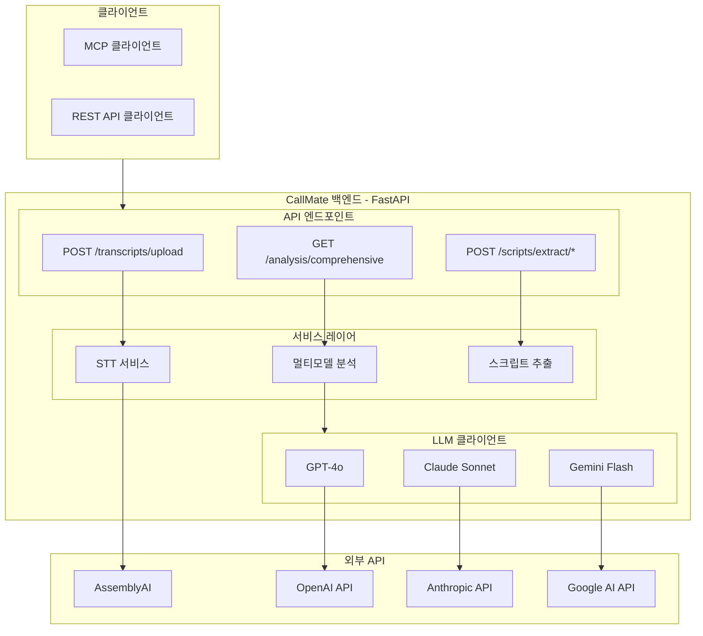
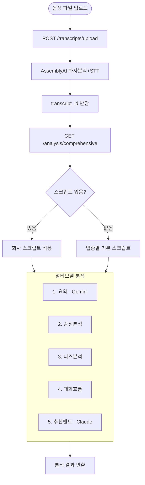
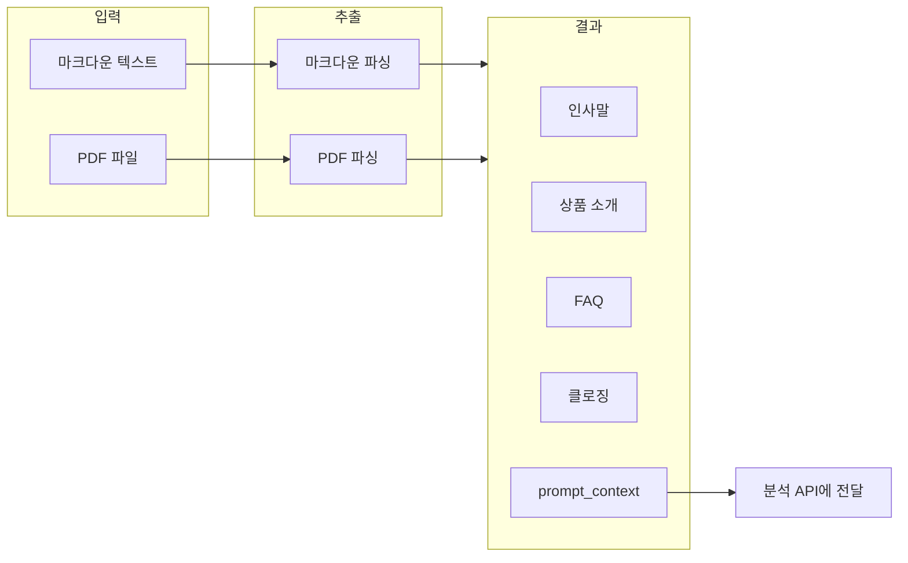

# CallMate 아키텍처 플로우차트

아래 Mermaid 코드를 https://mermaid.live 에서 이미지로 변환할 수 있습니다.

---

## 1. 전체 시스템 아키텍처

```mermaid
flowchart TB
    subgraph Client["클라이언트"]
        MCP["MCP 클라이언트"]
        API_CLIENT["REST API 클라이언트"]
    end

    subgraph Backend["CallMate 백엔드 - FastAPI"]
        subgraph API["API 엔드포인트"]
            TRANS_API["POST /transcripts/upload"]
            ANALYSIS_API["GET /analysis/comprehensive"]
            SCRIPTS_API["POST /scripts/extract/*"]
        end

        subgraph Services["서비스 레이어"]
            STT["STT 서비스"]
            ANALYSIS_SVC["멀티모델 분석"]
            SCRIPT_SVC["스크립트 추출"]
        end

        subgraph LLM["LLM 클라이언트"]
            OPENAI["GPT-4o"]
            CLAUDE["Claude Sonnet"]
            GEMINI["Gemini Flash"]
        end
    end

    subgraph External["외부 API"]
        ASSEMBLYAI["AssemblyAI"]
        OPENAI_API["OpenAI API"]
        ANTHROPIC_API["Anthropic API"]
        GOOGLE_API["Google AI API"]
    end

    Client --> API
    TRANS_API --> STT
    ANALYSIS_API --> ANALYSIS_SVC
    SCRIPTS_API --> SCRIPT_SVC
    STT --> ASSEMBLYAI
    ANALYSIS_SVC --> LLM
    OPENAI --> OPENAI_API
    CLAUDE --> ANTHROPIC_API
    GEMINI --> GOOGLE_API
```

---

## 2. 분석 요청 플로우

```mermaid
flowchart TD
    START([음성 파일 업로드]) --> UPLOAD["POST /transcripts/upload"]
    UPLOAD --> STT["AssemblyAI 화자분리+STT"]
    STT --> TRANS_ID["transcript_id 반환"]

    TRANS_ID --> ANALYSIS["GET /analysis/comprehensive"]
    ANALYSIS --> CHECK{스크립트 있음?}

    CHECK -->|있음| USE_SCRIPT["회사 스크립트 적용"]
    CHECK -->|없음| USE_INDUSTRY["업종별 기본 스크립트"]

    USE_SCRIPT --> MULTI["5단계 멀티모델 분석"]
    USE_INDUSTRY --> MULTI

    subgraph MULTI["멀티모델 분석"]
        STEP1["1. 요약 - Gemini"]
        STEP2["2. 감정분석"]
        STEP3["3. 니즈분석"]
        STEP4["4. 대화흐름"]
        STEP5["5. 추천멘트 - Claude"]
    end

    MULTI --> RESULT["분석 결과 반환"]
```

---

## 3. 스크립트 추출 플로우

```mermaid
flowchart LR
    subgraph INPUT["입력"]
        MD["마크다운 텍스트"]
        PDF["PDF 파일"]
    end

    subgraph EXTRACT["추출"]
        PARSE_MD["마크다운 파싱"]
        PARSE_PDF["PDF 파싱"]
    end

    subgraph OUTPUT["결과"]
        GREETING["인사말"]
        PRODUCT["상품 소개"]
        FAQ["FAQ"]
        CLOSING["클로징"]
        CONTEXT["prompt_context"]
    end

    MD --> PARSE_MD
    PDF --> PARSE_PDF
    PARSE_MD --> OUTPUT
    PARSE_PDF --> OUTPUT
    CONTEXT --> ANALYSIS["분석 API에 전달"]
```
